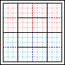
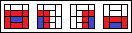
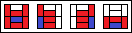
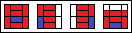

# Combat in Dungeoneers

As a Dungeoneer, you will encounter many foes that stand in your way to your inevitable goal. Some may be able to be avoided, but you will ultimately come to blows with many `creatures`. You should become familiar with combat mechanics in order to overcome these obstacles and complete your mission. When `creatures` come to blows, not all interactions between the combatants influence the results of the combat. These interactions still _happen_, but they are not the "spotlight". In Dungeoneers, combat only focuses on the spotlight.

Combat is a `scene` like any other `scene` and is handled via the same flow of play. However, GM `actions` are much more common during combat.

## Damage Types

Whenever a `wound` is sustained, there is a `damage type` associated with it. This is important as some `damage types` are more or less effective on certain `creatures`.

> For example, a skeleton won't be phased by a dagger because its `damage type` is piercing. However, a big maul smashes it to pieces with its bludgeoning `damage type`!

Each `damage type` is part of a category, and all types exist under the "damage" category. The following is a list of all `damage types` and the categories they fall under:

-   Damage
    -   Physical
        -   Bludgeoning (B)
        -   Piercing (P)
        -   Slashing (S)
    -   Energy
        -   Heat (H)
        -   Cold (C)
        -   Toxic (T)
        -   Disintegrate (D)
    -   Precision

## Zones and Range

Dungeoneers uses an abstraction of a battlefield by utilizing `zones`. A `zone` is a positioning segment of the battle map, of which there are 4 `zones` per side:

-   Front Line
-   Back Line
-   Left Flank
-   Right Flank

Each `zone` is made up of 2 `quadrants`, and each `quadrant` is made up of 9 `tiles`. A `tile` is the unit of space which a `medium` `creature` occupies. The purpose of `zones` is to allow for more flexible representations of a battle map while still providing tactical positioning value. For example, with `zones` it becomes a lot more clear to understand where your ally is, since you can say they are in the south `quadrant` of the enemy's right flank.

Accompanying `zones` are `ranges`, which again are simplified into the following tiers:

| Name     | Description                                                                                                         |
| -------- | ------------------------------------------------------------------------------------------------------------------- |
| Self     | Can only affect the `creature` using the `ability`                                                                  |
| X Tiles  | Has a range measured in `tiles`                                                                                     |
| Quadrant | Affects the `quadrant` the `creature` is in                                                                         |
| Zone     | Affects the `zone` the `creature` is in                                                                             |
| Short    | Affects any `quadrant` adjacent to the `zone` the `creature` is in                                                  |
| Medium   | Affects any `zone` adjacent to the `zone` the `creature` is in                                                      |
| Long     | Affects any `quadrant` adjacent to the `zone` the `creature` is in, or any `quadrant` adjacent to those `quadrants` |

The `short`, `medium` and `long` ranges might be slightly unclear, so to illustrate visually both the zones and these 3 ranges, you can refer to the below illustrations:

**Short Range**

**Medium Range**

**Long Range**

After using an `action` with a `short`, `medium` or `long` range, you must `move` to the `quadrant` closest to the target. For example, if Freya is stood in the `front line` right `quadrant` and makes a `short` range `strike` against a `creature` in the opposing `front line` left `quadrant`, she must end up standing in the left `quadrant` of the `front line`.

In addition to these `zones` being descriptive, they all have different effects to the `creatures` within them.

### Front Line

A `creature` in the `front line` has the `wounds` they deal increased by 1. This is from any and all sources, and this bonus applies to any `zone` on the opposing side. For example, a dungeoneer in the opposing sides' `left flank` _also_ gets this bonus to their `wounds` dealt.

### Left & Right Flank

 

A `creature` in either the `left flank` or the `right flank` is able to `hide` without being `shrouded` or `covered`.

### Back Line

A `creature` in the `back line` has their `missile` weapon range increased by 1 `quadrant`.

### Beyond the Back Line

Any `creature` past the `back line` is considered to have fled combat. They cannot be targeted, nor can they target any `creatures`.

### Drawing Zones

`Zones` are meant to be flexible while still representing the structure of the battlefield. When `zones` are initially drawn, the midpoint of the two closest combatants is considered the start of each sides' `front line`. If ever it makes sense to redraw `zones` because the battle has shifted significantly enough, utilize the above to redraw the `zones`.

Typically, this will happen one side has been pushed significantly back, or one line is intentionally moving back while maintaining formation. While players can request a redraw of `zones`, the GM has the final say on whether or not `zones` are redrawn.

## Combat Actions

The `actions` found here are ones that are most applicable during combat. As a reminder, any `action` can be taken at any time, as long as it applies.

### Sprint

-   Tags: Movement, Momentum
-   Range: Self

---

You may use the `sprint` `action` to `move` additional times.

`Standard` (`body`) - Average (2)

-   Lesser success (-1): You may `move` using 1x your `speeds`
-   Success (0): You may `move` using 2x your `speeds`
-   Greater success (1): You may `move` using 3x your `speeds`

### Grapple

-   Tags: Attack
-   Range: Zone

---

You must have a hand free in order to take this `action`.

`Core`: (`body`, `striking`) - `Dodging difficulty`

-   Lesser success (-1): Your target is `grappled` and you are `grappling`, `Countdown`: `RC`(1)
-   Success (0): Your target is `grappled` and you are `grappling`
-   Greater success (1): Your target is `grappled` and you are `grappling`, your target also gains 1 `stress`

### Push

-   Tags: Attack, Forces
-   Range: Short

---

You may use the `push` `action` to reposition another `creature` or an object.

`Core`: (`body`, `striking`) - `Dodging difficulty`

-   Lesser success (-1): Your target is `forced` 1 tile
-   Success (0): Your target is `forced` 2 tiles or knocked `prone`
-   Greater success (1): Your target is `forced` 2 tiles and knocked `prone`

If the target is an object, the `DN` is the `size number` of the object.

### Strike

-   Tags: Attack, Deadly
-   Range: Varies on Weapon

---

A `strike` is an `action` that constitutes attacking a `creature` with some sort of weapon. This weapon could be a club, a dagger, an enchanted staff, or even a bare fist! During a `strike`, the `attacker` is the `creature` making the `strike` and the `defender` is the `creature` subject to the `strike`.

`Core`: (`finesse`, `striking`) - `Dodging difficulty`

-   Lesser success (-1): Your target gains a number of `stress` equal to the `wounds` from your weapon
-   Success (0): Your target takes a number of `wounds` equal to the `wounds` from your weapon
-   Greater success (1): Your target takes a number of `wounds` equal to _twice_ the `wounds` from your weapon

A `hit` occurs on a result of a success or better.

### Hold the Line

-   Tags: Movement, Momentum
-   Range: Quadrant

---

You prevent `creatures` of your choice from entering your `quadrant`.

`Total`: (`body`, `striking`)

-   You prevent any `creature` with a `size score` lower than your roll from entering your `quadrant`

### Hide

-   Tags: Stealth, Momentum
-   Range: Self

---

If you are `shrouded` or better, or are in the `left flank` or `right flank`, you may attempt to `hide`.

`Core`: (`finesse`, `stealth`) - `Notice difficulty`

-   Lesser Success (-1): You are `hidden` until you `move`
-   Success (0): You are `hidden` until you take an `action`
-   Greater Success (1): You are `hidden` until the end of the `combat round` of your next `action`

### End Condition

-   Tags: Restoration
-   Range: Zone

---

You attempt to end a `condition` that is ailing another `creature` within your `zone`.

`Standard`: (`mind`) - Average (2)

-   Lesser Success (-1): You end 1 `condition` of your choice, but you and the target gain 1 `stress`
-   Success (0): You end 1 `condition` of your choice
-   Greater Success (1): You end 1 `condition` of your choice and the target loses 1 `stress`

## Combat Free Actions

The `free actions` found here are ones that are most applicable during combat.

### Dodge

-   Tags: Dodging
-   Range: Self

---

You attempt to avoid an incoming `attack`. If you are targeted by an `attack`, you may make a `dodging` roll to avoid it.

`Core`: (`body`, `dodging`) - `Striking difficulty`

-   Misstep (-2): You take the `wounds` from the `attack`
-   Lesser success (-1): You take 1 fewer `wounds` from the `attack` (to a minimum of 1 `wound`)
-   Success (0): You take the `wounds` from the `attack` as `stress`
-   Greater success (1): You take no `wounds` from the `attack`

If you are being targeted by more than 1 `attack`, your roll applies to all of them.

### Reposition

-   Tags: Movement
-   Range: Self

---

A `creature` may use the `reposition` `action` to `move` or stand up.

### Interact

-   Tags: Interaction
-   Range: Zone

---

You may `interact` to manipulate your environment. Opening doors, pulling levers, drawing or stowing a weapon, equipping a shield, drinking a potion, picking up an object, and similar such tasks can all be accomplished.

### Drop Prone

-   Tags: Movement
-   Range: Self

---

You immediately fall `prone`.

### Mount

-   Tags: Movement
-   Range: Zone

---

You may climb onto a willing `creature` at least one `size` larger than you.

### Channel

-   Tags: Arcana
-   Range: Self

---

You gain 2 stacks of `channeling`.

## Deadly Hits

For `actions` with the `deadly` `tag`, for each `success` above a greater success, the `wounds` from the `action` are applied again.

> Example: a `strike` that deals 4 `wounds` on a success and 8 `wounds` on a greater success would deal 12 `wounds` at +2 `successes`, 16 wounds at +3 `successes` and so on.
